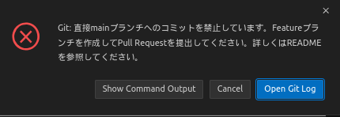
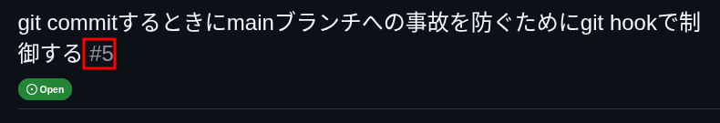

# チーム開発ガイド (Team Development Guide)

このドキュメントは、Air-Visualizerプロジェクトにおけるチーム開発のルールとベストプラクティスをまとめたものです。円滑な開発と高品質なコードベースを維持するために、チーム全員がこのガイドラインに従ってください。

## 1. コミュニケーション (報連相)

ソフトウェア開発において、コミュニケーションはコードを書くことと同じくらい重要です。「報連相（報告・連絡・相談）」を基本とし、透明性の高い開発を心がけましょう。

### 基本原則
- **Bad News First**: 問題や遅延が発生しそうな場合は、**直ちに**報告してください。早ければ早いほど、対策の選択肢が増えます。
- **オープンな場での議論**: 個別のDMではなく、チーム全体のチャンネルで議論しましょう。情報の属人化を防ぎ、全員がコンテキストを共有できるようにします。
- **テキストコミュニケーション**: 非同期での作業も多いため、テキストでログを残すことを意識してください。口頭で話した内容も、決定事項は必ずテキストに残しましょう。

### 具体的なアクション
- **報告**: タスクの完了、マイルストーンの達成、障害の発生など。
- **連絡**: 仕様の変更、スケジュールの変更、不在の連絡など。
- **相談**: 実装方針に迷った時、技術的な壁にぶつかった時、仕様が曖昧な時。
    - 「15分考えてわからなければ相談する」ルールを推奨します。一人で抱え込まないでください。

## 2. Gitワークフロー & ブランチ戦略

本プロジェクトでは、コードの品質と安定性を保つために、以下のGitワークフローを採用します。

### ブランチ戦略
- **Main Branch (`main`)**:
    - 常にデプロイ可能な状態（Production Ready）を保ちます。
    - **直接 `push` することは禁止です。** 必ずPull Request (PR) を通してマージする必要があります。
- **Feature Branches (`feature/xxx`, `fix/xxx`)**:
    - 新機能開発やバグ修正は、`main` からブランチを切って行います。
    - 命名規則:
        - 機能追加: `feature/機能名` (例: `feature/add-transcript-api`)
        - バグ修正: `fix/バグ内容` (例: `fix/websocket-connection-error`)
        - リファクタリング: `refactor/内容` (例: `refactor/auth-middleware`)
        - ドキュメント: `docs/内容` (例: `docs/update-readme`)

### 開発フロー
1. **最新化**: 作業開始前に必ず `main` ブランチを最新にします。
   ```bash
   git checkout main
   git pull origin main
   ```
2. **ブランチ作成**: 作業用ブランチを作成します。
   ```bash
   git checkout -b feature/my-new-feature
   ```
3. **コミット**: こまめにコミットします（後述）。
4. **Push**: リモートリポジトリにPushします。
   ```bash
   git push origin feature/my-new-feature
   ```
5. **Pull Request (PR)**: GitHub上で `main` に対してPRを作成します。
6. **レビュー & マージ**: チームメンバー（最低1名）の承認を得てからマージします。

### コミットのガイドライン
- **こまめにコミットする**:
    - 作業の区切りごとにコミットしてください。「1日1コミット」のような巨大なコミットは避けましょう。
    - 変更内容が追いやすく、問題発生時の切り分け（`git bisect`等）が容易になります。
- **コミットメッセージ**:
    - **何をしたか** が明確にわかるように記述してください。
    - プレフィックスをつけることを推奨します（例: `feat:`, `fix:`, `docs:`, `style:`, `refactor:`, `test:`, `chore:`）。
    - 例: `feat: 会話の保存APIエンドポイントを追加`

### トラブルシューティング

#### `main` ブランチへのコミットエラー
`main` ブランチ上で `git commit` を実行すると、以下のエラーが表示されることがあります。



これは、誤って `main` ブランチに直接コミットすることを防ぐためのフック（Git Hook）が作動しているためです。

**対処法:**
作業用の新しいブランチを作成して、そこにコミットしてください。

```bash
# 1. 新しいブランチを作成して移動（ステージング済みの変更も引き継がれます）
git checkout -b feature/<issue-number>

```
issue-numberはissueから番号を取得できます。
(画像要参照)


この画像だとブランチ名は、feature/5となります。

```bash
# 2. 改めてコミットする
git commit -m "feat: 変更内容"
```

## 3. Pull Request (PR) ルール

PRはコードレビューを行う重要な場です。レビュアーが理解しやすいPR作成を心がけましょう。

### PR作成時のチェックリスト
- [ ] **タイトル**: 変更内容がひと目で分かるタイトルにする。
- [ ] **概要**: 何を解決するための変更か、どのような実装をしたかを簡潔に記述する。
- [ ] **関連Issue**: 対応するIssueがあればリンクする（例: `Closes #123`）。
- [ ] **動作確認**: ローカルでの動作確認手順や、テスト結果（スクリーンショット等）を添付する。
- [ ] **セルフレビュー**: レビュアーに投げる前に、自分でDiffを確認し、不要なコード（デバッグログ等）が含まれていないかチェックする。

### レビューを受ける側の心得
- 指摘は「コードに対するもの」であり、「人格に対するもの」ではありません。ポジティブに受け取りましょう。
- 議論が必要な場合は、コメントだけでなく、必要に応じて通話などで同期的に解決しましょう。

### レビュアーの心得
- 良い点も積極的にコメントしましょう（「LGTM!」「良い実装ですね！」）。
- 指摘は具体的かつ建設的に行いましょう。
- コードスタイルなどの些末な指摘よりも、設計やバグの可能性、可読性などの本質的な部分に集中しましょう。

---

## 4. Air-Visualizer プロジェクト特有の注意点

### 環境構築
- `mise` を使用して開発環境を統一しています。新しい依存関係を追加した場合は、必ずドキュメント (`docs/ENVIRONMENT_SETUP.md`) を更新し、チームに周知してください。

### ディレクトリ構成
- Backend (`backend/`) と Extension (`extension/`) が同居するモノレポ構成です。
- 変更がどちら（あるいは両方）に影響するかを意識して開発してください。

---

**Happy Coding! 🚀**
